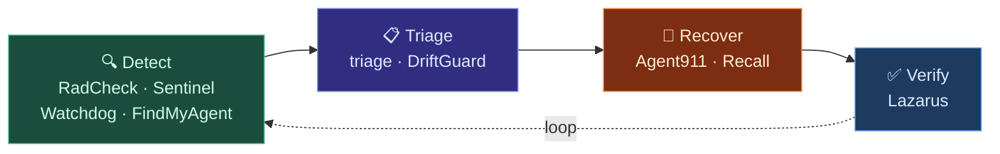
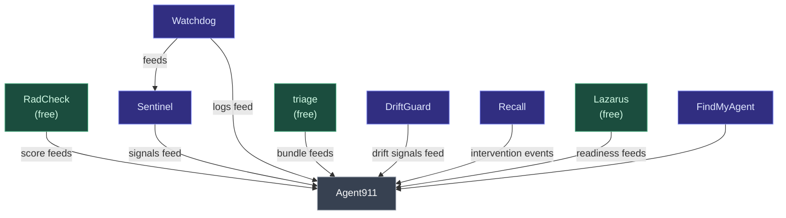

# The Reliability Stack

Agents fail in ways that aren't crashes. They stall, drift, go silent, or degrade slowly — and standard monitoring misses all of it. ACME builds a set of tools that cover the full lifecycle of an agent reliability problem: detecting it, understanding it, recovering from it, and verifying you're actually back.

## The Lifecycle

Start anywhere. Most people start with **Detect** — a free RadCheck scan — and add more as they need it.

---

## Tool by Tool

### Detect

These tools tell you something is wrong — or about to be.

**[RadCheck](/docs/products/radcheck/overview)** — Free scan, 0–100 score

A fast read-only scan that scores your stack across five domains: config health, watchdog health, model routing, environment, and port vs. probe detection. Run it before you deploy. Run it after something breaks. Run it when something feels off.

**[Sentinel](/docs/products/sentinel/overview)** — Continuous monitoring

Always-on detection that watches for silence gaps, stall patterns, and memory pressure while your agents are running. Tells you before your users do.

**[Watchdog](/docs/products/watchdog/overview)** — Heartbeat and liveness

Distinguishes "running" from "actually working." Catches the frozen-event-loop pattern that passes every naive health check.

**[FindMyAgent](/docs/products/findmyagent/overview)** — Fleet presence

Which agents are up, which are stalled, which need attention — at a glance. Included with Agent911.

---

### Triage

These tools help you understand what happened.

**[triage](/docs/products/triage/overview)** — Free diagnostic snapshot

Captures a proof bundle — gateway health, session state, disk pressure, compaction history — before you change anything. Your evidence. Run it first.

**[DriftGuard](/docs/products/driftguard/overview)** — Memory integrity

Catches slow behavioral drift before it compounds. Watches memory artifacts session-to-session and flags when something diverges from baseline.

---

### Recover

These tools coordinate getting you back.

**[Agent911](/docs/products/agent911/overview)** — Unified incident view

Reads everything — RadCheck score, Sentinel state, Watchdog logs, backup readiness — and shows it in one place. Tells you what's wrong and what to check first.

**[Recall](/docs/products/recall/overview)** — Direct intervention CLI

For when you need to reach in and stop something. Pause an agent, isolate a broken one, stun a runaway. The manual control layer.

---

### Verify

**[Lazarus](/docs/products/lazarus/overview)** — Recovery readiness check

Most people discover their backups don't work during an actual incident. Lazarus checks proactively: backup coverage, restore validation, readiness score. Free.

---

## How It Connects

Agent911 sits at the center — it reads every signal and shows you the full picture. Everything else feeds it.

---

## Where to Start

**Just getting started:**
1. Run [RadCheck](/docs/products/radcheck/overview) — free, takes under a minute, shows you where you stand
2. Install [triage](/docs/products/triage/overview) — free, use it when something breaks before you touch anything
3. Run [Lazarus](/docs/products/lazarus/overview) — free, confirm you can actually recover

**Running multiple agents and tired of surprises:**

Add Sentinel + Watchdog + Agent911. You'll know about problems before your users do.

**Something broke right now:**

Run `triage` first. Then open Agent911. Don't restart anything until you know what you're restarting.

---

## Free vs. Paid

| Tool | Tier |
|------|------|
| RadCheck | Free |
| triage | Free |
| Lazarus | Free |
| Sentinel | Paid |
| Watchdog | Paid |
| Agent911 + FindMyAgent | Paid |
| Recall | Paid |
| DriftGuard | Paid |

See [Pricing](/docs/pricing) for current rates.

<CardGroup cols={2}>
  <Card title="Run your first scan" icon="magnifying-glass" href="/docs/products/radcheck/overview">
    RadCheck is free and takes under a minute.
  </Card>
  <Card title="Something broke?" icon="circle-question" href="/docs/products/triage/overview">
    Install triage and run it before you touch anything.
  </Card>
</CardGroup>
