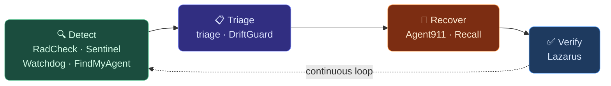

# Platform Overview

ACME is a reliability stack for AI agent operators. The products aren't a bundle of unrelated tools — they form a coherent system designed around how agent failures actually happen and how operators actually respond to them.

## The Reliability Loop

Agent reliability follows a loop. ACME tools map to each phase:



Every tool has a defined place in this loop. No tool overlaps with another in responsibility. Each handoff is explicit.

## Layer by Layer

### Detect

Tools that identify problems — before users do.

| Tool | What It Detects |
|------|----------------|
| [RadCheck](/docs/products/radcheck/overview) | Point-in-time reliability risk (0–100 score) |
| [Sentinel](/docs/products/sentinel/overview) | Real-time stalls, silence gaps, runtime anomalies |
| [Watchdog](/docs/products/watchdog/overview) | Missed heartbeats, liveness failures, throughput collapse |
| [DriftGuard](/docs/products/driftguard/overview) | Long-horizon behavioral drift across sessions |
| [FindMyAgent](/docs/products/findmyagent/overview) | Fleet presence — who's up, who's stalled, who needs attention |
| [SphinxGate](/docs/products/sphinxgate/overview) | Unauthorized routing, policy violations, audit anomalies |

### Triage

Tools that help you understand what happened and what to do.

| Tool | What It Classifies |
|------|-------------------|
| [Triage](/docs/products/triage/overview) | Incident type, root cause, evidence bundle, next steps |
| [DriftGuard](/docs/products/driftguard/overview) | Drift patterns and memory integrity issues |

### Recover

Tools that coordinate and guide recovery.

| Tool | What It Provides |
|------|----------------|
| [Agent911](/docs/products/agent911/overview) | Unified control plane — telemetry, playbooks, proof bundles |
| [Watchdog](/docs/products/watchdog/overview) | Escalation and handoff to recovery workflow |

### Verify

Tools that confirm recovery was actually successful.

| Tool | What It Verifies |
|------|----------------|
| [Lazarus](/docs/products/lazarus/overview) | Recovery readiness — can your system actually restore? |

### Model Routing

| Tool | Role |
|------|------|
| [Transmission](/docs/products/transmission/overview) | Routes each task to the right model based on work type, lane, and classifier confidence |

---

## Common Deployment Patterns

### Starting Out: Free Baseline

No account. No commitment. Just run it.

```
RadCheck → triage → Lazarus
```

- RadCheck tells you where your stack stands right now
- triage captures a snapshot when something goes wrong
- Lazarus confirms you can actually recover if you need to

**Cost:** Free.

---

### Staying Up: Core Stack

For when you've got agents running and you need to know about problems before your users do.

```
Sentinel + Watchdog → Agent911 + FindMyAgent
       ↓                      ↓
  Catches problems       Tells you what to do
```

- Sentinel notices silence gaps and stalls while you're away
- Watchdog confirms liveness — running vs. actually working
- Agent911 shows you what's wrong and where to start
- FindMyAgent tells you which agents are healthy and which need attention

**Good for:** Anyone running more than one agent and tired of finding out something broke after the fact.

---

### Multi-Model Stacks: Add SphinxGate + Transmission

For when you're routing across multiple models and want it to be smart, not hand-coded.

```
Core Stack + SphinxGate + Transmission
```

- SphinxGate enforces which models go where — no accidental expensive calls from background jobs
- Transmission classifies each task and picks the right model automatically — a coding task routes to a coding model, a simple lookup goes somewhere cheaper

**Good for:** Anyone using more than one provider and tired of one-size-fits-all model config.

---

### Full Stack: Operator Bundle

All tools. Full coverage across detection, triage, routing, recovery, and verification.

See the [Operator Bundle](/docs/products/operator-bundle) for details and pricing.

---

## Design Principles

### Observe, don't interfere

ACME tools watch your systems. They do not autonomously modify agent behavior, restart processes, or take recovery actions without operator direction. Every action that changes system state is operator-initiated.

This is intentional. Autonomy without understanding creates more incidents, not fewer.

### Evidence-first

Every detection includes evidence. Every incident includes a proof bundle. Every recovery includes a readiness check. The goal is that operators always know *why* a tool is telling them something, not just *what*.

### Deterministic playbooks

Recovery shouldn't depend on how well you know the system at 2am. Agent911 playbooks give you the same deterministic path every time. Same incident type → same playbook → same recovery.

### Free tools that are actually useful

RadCheck, triage, and Lazarus are free — not crippled demos. You can understand your stack and catch real problems with them before spending anything. The paid tools add always-on monitoring and a unified incident view for when the free pass-through isn't enough.

---

## What ACME Is Not

<Info>
Understanding what we don't do is as important as understanding what we do.
</Info>

**ACME is not:**
- An orchestration framework (we watch your agents, not direct them)
- An autonomous healing system (operators always act)
- A replacement for logging/APM (we're the reliability layer on top)
- Agent-specific (we work with OpenClaw, LangChain, AutoGPT, custom systems)

---

## Getting Started

<CardGroup cols={2}>
  <Card title="5-Minute Quickstart" icon="rocket" href="/quickstart">
    Get RadCheck running and your first reliability score.
  </Card>
  <Card title="All Products" icon="grid" href="https://acmeagentsupply.com/products">
    Browse every tool with descriptions and pricing.
  </Card>
  <Card title="Pricing" icon="tag" href="/pricing">
    See free vs. paid options and bundles.
  </Card>
  <Card title="Support" icon="life-ring" href="/support">
    Get help. We respond fast.
  </Card>
</CardGroup>
