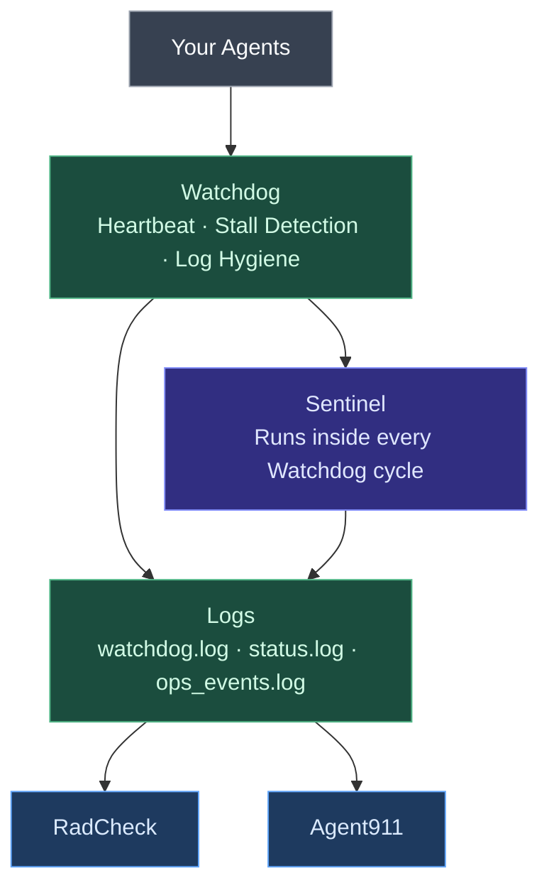

# Watchdog

Your process monitor says your agent is up. Watchdog checks whether it's actually doing anything.

That gap — between a port being open and real work happening — is where most quiet failures live.

## The Problem It Solves

Standard health checks answer: *is the process alive?*

Watchdog answers: *is it progressing?*

An agent can be fully "running" — port open, process active — and be completely frozen. Compaction events, hung model calls, and stuck loops all look healthy from the outside. Watchdog looks for the difference.

## How It Works

Watchdog runs a heartbeat loop on your gateway. Every probe, it checks not just that the port responds, but that the gateway is actually processing. If probes start failing:

- It doesn't fire immediately — it waits for 3 consecutive failures before acting (no false alarms from a single blip)
- After confirmed failure, it emits a `GATEWAY_STALL` event and can trigger a restart
- Every action is logged before it happens — you always have a record

## Keeping Your Disk Clean

Watchdog v1.2 also handles log hygiene automatically:

- Warns when log files hit 2MB, trims at 10MB
- Manages the restore staging directory — warns at 100MB, prunes at 250MB
- Conservative by default — never deletes without writing to the log first

This matters if you're running long-lived agents. Logs accumulate. Watchdog keeps them from quietly eating your disk.

## What It Writes

Everything Watchdog does gets written somewhere. Nothing is silent.

| File | What's In It |
|------|-------------|
| `watchdog.log` | Probe results, stall events, restart actions |
| `status.log` | Current liveness state — Sentinel and Agent911 read this |
| `ops_events.log` | Every significant action, append-only |
| `hygiene.log` | Disk and log management actions |

These files are the foundation. RadCheck reads them. Sentinel runs inside the Watchdog loop. Agent911 pulls from all of them. If Watchdog isn't running, everything else is working from stale data.

## Where It Fits

Watchdog is layer zero. Start here.
